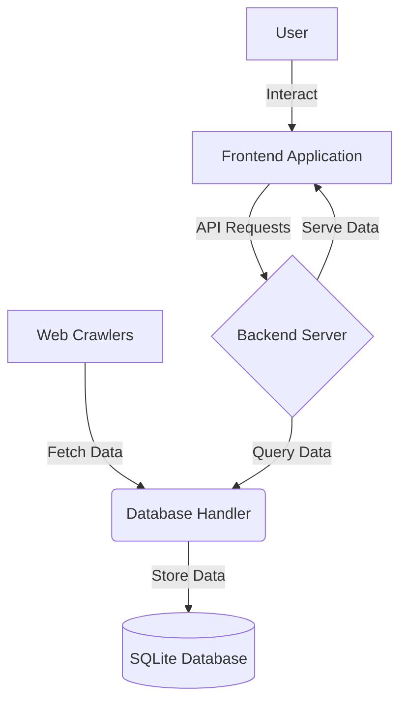

# UDBP (Universal Database Plugin)

UDBP is a flexible and extensible database handling system designed to simplify data storage and retrieval for web crawlers and other applications. It provides a unified interface for interacting with different database types, currently supporting SQLite.

## Table of Contents

1. [Features](#features)
2. [System Architecture](#system-architecture)
3. [Components](#components)
4. [Installation](#installation)
5. [Usage](#usage)
6. [API Endpoints](#api-endpoints)
7. [Contributing](#contributing)
8. [License](#license)

## Features

- Unified interface for multiple database types (currently SQLite)
- Dynamic model creation and schema generation
- Support for nested data structures
- RESTful API for data storage and retrieval
- Asynchronous database operations with worker threads
- Automatic foreign key handling

## System Architecture

The UDBP system consists of several interconnected components:

1. Web Crawlers: Fetch data from various sources
2. Database Handler: Manages data storage and retrieval
3. SQLite Database: Stores the collected data
4. Backend Server: Provides API endpoints for interacting with the database
5. Frontend Application: Allows users to interact with the stored data



## Components

### Database Handler (`dbhandler_plugin.py`)

The core component that manages database operations. It supports:

- Dynamic model loading and creation
- Data storage and retrieval
- Schema creation and management

### Database Models (`database_model.py`)

Defines the base classes for creating database models:

- `Model`: Base class for all database models
- `DBfield`, `DBint`, `DBtext`, `DBreal`, `DBblob`: Field types for model definition

### Main Server (`main.py`)

Flask server that provides RESTful API endpoints for interacting with the database:

- `/connect`: Initialize database connection and schema
- `/store`: Store individual data items
- `/bulk_store`: Store multiple data items in bulk
- `/retrieve`: Retrieve data based on filters

## Installation

1. Clone the repository:
   ```
   git clone https://github.com/Uggeli/udbp.git
   cd udbp
   ```

2. Install the required dependencies:
   ```
   pip install -r requirements.txt
   ```

3. Set up the SQLite database path in `config.py`.

## Usage

1. Start the Flask server:
   ```
   python main.py
   ```

2. Use the provided API endpoints to interact with the database.

3. Implement your data models in the `models` directory.

4. Use the `DatabaseHandler` class in your applications to interact with the database programmatically.

## API Endpoints

- `POST /connect`: Initialize database connection and schema
  - Payload: `{ "dbname": "your_db_name", "dbtype": "sqlite", "db_models": { ... } }`

- `POST /store`: Store individual data items
  - Payload: `{ "dbname": "your_db_name", "dbtype": "sqlite", "datatype": "model_name", "data": { ... } }`

- `POST /bulk_store`: Store multiple data items in bulk
  - Payload: `{ "dbname": "your_db_name", "dbtype": "sqlite", "datatype": "model_name", "data": [ ... ] }`

- `POST /retrieve`: Retrieve data based on filters
  - Payload: `{ "dbname": "your_db_name", "dbtype": "sqlite", "datatype": "model_name", "filters": { ... } }`

## Contributing

Contributions are welcome! Please feel free to submit a Pull Request.

## License

This project is licensed under the MIT License.
